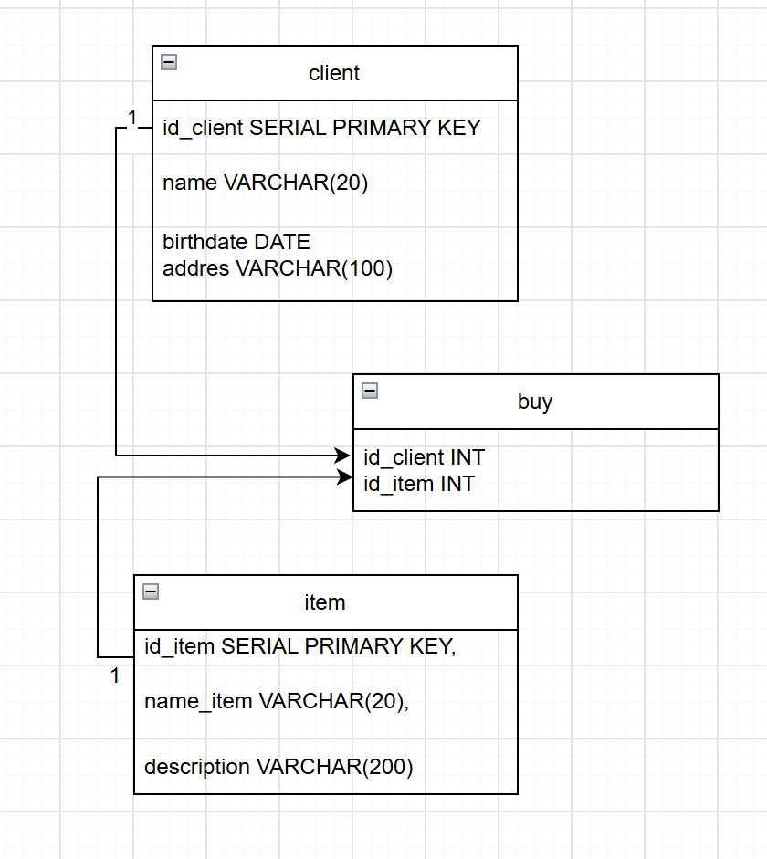

<h1>Отчет по проекту</h1>

<h2>О чем проект и в чем его цель</h2>

Это учебный проект, сделанный в формате лабораторной работы по курсу "Базы данных". 
Целью проекта я поставила демонстрацию навыков написания простых запросов с использованием операций <b>UNION, UNION ALL, INTERSECT, EXCEPT, JOIN</b>, а также запросов 
с использованием <b>сортировки и агрегационных запросов ORDER BY, GROUP BY, работа с нормализацией</b>.
Задача проекта состояла в создании базы данных, имитирующей работу сервиса для совершения онлайн покупок.

<h2>Структура базы данных</h2>

1. Таблица <b>client</b> содержит данные о клиентах - айди, имя, адрес, дата рождения
2. Таблица <b>item</b> содержит данные о товарах в магазине - айди, наименование, описание
3. Таблица <b>buy</b> создана для объединения данных из двух предыдущих таблиц. Содержит айди покупателя и товара.

Таблицы client и item соответствуют третьей нормальной форме 3НФ:
   1. Все поля атрибутов атомарны
   2. В обеих таблицах используется простой ключ
   3. Никакие не ключевые атрибуты не зависят друг от друга, а зависят только от ключа напрямую
Таблица buy подходит под НФ3

<h2>Схема базы данных</h2>

Между таблицами есть связи

   1. между таблицами client и buy связь <b>"один ко многим"</b> так как один клиент может купить много товаров
   2. между таблицами "item" и "buy" связь <b>"один ко многим"</b> так как один товар может быть куплен много раз

<h2>Обоснование выбора типа данных</h2>

1. выбор ключа SERIAL PRIMARY KEY оптимальный, так как он создается автоматически и он достаточен для учебного проекта, так как я не имею большого кол-ва записей
в таблице. Также можно использовать более новый стандарт IDENTITY
2. для текстовых полей был выбран тип VARCHAR() для ограничения поля по символам. Для каждого поля выбрано свое кол-во символов, достаточное для вмещения данных
3. birthday DATA хранит в себе только дату и не хранит время. Этого достаточно для отслеживания возраста клиента.

